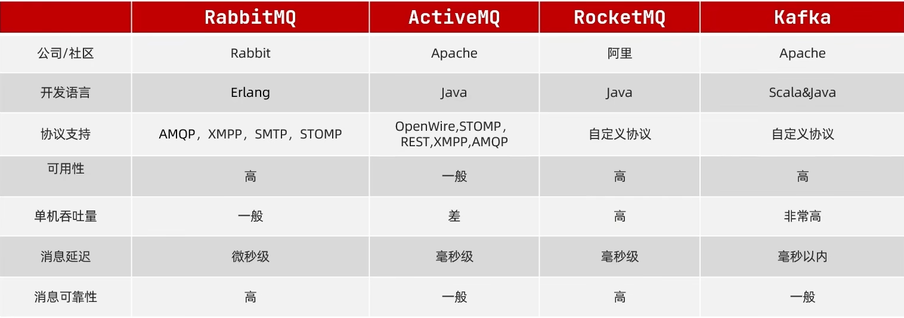

# MQ

## 一、消息队列分类



**<font color=red>消息队列是一种将消息进行转发给多个用户的发布器</font>**

### 1.1 Rabbit MQ

特点：

可用性高，单机吞吐量一般，消息延迟低，消息可靠性高

### 1.2 Active MQ

特点：各方面都一般或者比较差

### 1.3 Rocket MQ

特点：

可用性高，单机吞吐量高，消息延迟低，消息可靠性高

### 1.4 Kafka

特点：

可用性高，单机吞吐量很高，消息延迟低，消息可靠性一般般

## 二、Rabbit MQ

### 2.1 交换器

* 定义：
  只负责消息的转发，如果路由转发失败，消息就会丢失
* 分类
  * FanoutExchange
    广播路由器，会将收到的消息发送给每一个绑定的队列
  * DirectExchange
    直接交换机，通过指定的routingKey将收到的消息发送给绑定队列
  * TopicExchange
    主题交换机，使用方法和直接交换机一致，不过它必须使用多个单词并通过符号 . 进行拼接，然后通过通配符的形式将收到的消息转发给匹配的队列（#代表任意个、*代表一个）

### 2.2 路由键（routingKey）

* 当使用DirectExchange或者TopicExchange时用来作为绑定关系的字符串

### 2.3 消息队列

* 负责从交换机中获取数据然后发给指定的消费者，如果有多个消费者同时从一个队列中获取数据，那么这多个消费者只能按照声明的顺序轮流获取队列中的数据，因为队列中的消息一旦被消费就不会保留。所以如果一个消费者消费了队列中的某个消息之后，其他消费者是无法获取的这个消息的。

### 2.4 消息的可靠性投递

* **<font color=red>确认回调函数</font>**

  ~~~java
  rabbitTemplate.setConfirmCallback(new RabbitTemplate.ConfirmCallback() {
              /**
               * 确认消息是否被交换机接收的回调函数
               * @param correlationData data to correlate publisher confirms.
               * @param b 交换机是否接收到消息
               * @param s 交换机接收消息失败的原因
               */
              @Override
              public void confirm(CorrelationData correlationData, boolean b, String s) {
                  System.out.println("发送消息成功。。。");
                  if (!b) {
                      System.err.println("消息接收失败，失败原因是" + s);
                  } else {
                      System.out.println("消息接收成功。。");
                  }
              }
          });
  ~~~

  **作用**：当生产者发送出消息之后，该函数就会自动执行，通过该函数中的boolean类型的参数就可以直到交换机接收消息是否成功。
  **使用步骤**：

  1. 在配置文件中开启确认回调函数。

     ~~~yml
     spring:
       rabbitmq:
         port: 5672
         username: root
         password: root
         host: 192.168.220.129
         publisher-confirm-type: correlated
     ~~~

  2. 通过rabbitTemplate对象调用回调函数。

* **<font color=red>返回回调函数</font>**

  ~~~java
  rabbitTemplate.setMandatory(true);
          rabbitTemplate.setReturnCallback((message, replyCode, replyText, exchange, routingKey) -> {
              System.out.println("return 返回消息");
              System.out.println("交换机: " + exchange + "接收到消费者的消息: " + new String(message.getBody())
                      + ", 但是未通过指定的路由键：" + routingKey + "发送给消费者的队列，错误码是" +
                      replyCode + ", 对应的错误信息为：" + replyText + "：" + routingKey);
  
          });
  ~~~

  **作用**：当消息从交换机发出之后，用来确定该消息是否被队列接收，<font color=red>如果队列接收到该消息，返回回调函数就不会执行，如果接收失败就会执行返回回调函数中的内容</font>
  **使用步骤**：

  1. 在配置文件中开启返回回调函数。

     ~~~yml
     spring:
       rabbitmq:
         port: 5672
         username: root
         password: root
         host: 192.168.220.129
         publisher-returns: true
     ~~~

  2. 将丢失的消息开启处理模式，默认情况下丢失的消息不会进行处理，只有通过rabbitTemplate对象进行api的调用才能开启处理

     ~~~java
     rabbitTemplate.setMandatory(true);
     ~~~

  3. 设置返回回调函数

### 2.5 消费者端的确认机制

* <font color=red size=4>消费端使用Ack机制</font>进行确认消息的签收，签收方式有3种
  * none 自动签收 
    默认方式，spring中的RabbitTemplate对象就是一个消息监听器，它的签收方式默认就是自动签收
  * manual 手动签收 
    首先需要在程序中注册一个<font color=red>监听器容器</font>，接着将连接的参数通过<font color=red>连接工厂</font>设置到监听器容器，然后通过<font color=red>监听器容器</font>设置确定机制为手动确认。最后将设置好接收消息的队列和消息监听器进行绑定，就能实现手动签收。
    可以通过自己配置一个消息监听器（实现MessageListener接口），但是想要进行自动签收（通过Channel对象）就需要实现MessageListener的一个子接口ChannelAwareMessageListener然后实现它的onMessage方法，通过其中的Channel对象调用basicAck方法进行手动签收。
  * auto 根据签收异常的不同进行不同的逻辑操作

* 手动监听实现示例1（自定义消息监听器）

  * 配置连接参数

    ~~~yml
    spring:
      rabbitmq:
        port: 5672
        username: root
        password: root
        host: 192.168.220.129
        listener:
          direct:
            prefetch: 1
        virtual-host: "/"
    ~~~

  * 注册连接工厂

    ~~~java
    /**
     * 注册连接工厂用来连接rabbitMQ主机
     * @return 监听工厂
     */
    @Bean
    public ConnectionFactory connectionFactory(RabbitProperties properties) {
        CachingConnectionFactory factory = new CachingConnectionFactory();
        factory.setUsername(properties.getUsername());
        factory.setPassword(properties.getPassword());
        factory.setHost(properties.getHost());
        factory.setPort(properties.getPort());
        factory.setVirtualHost(properties.getVirtualHost());
        return factory;
    }
    ~~~

  * 配置消费队列

    ~~~java
    @Bean
    public FanoutExchange fanoutExchange1() {
        return new FanoutExchange("com.yang");
    }
    ~~~

  * 自定义消息监听器

    ```java
    /**
     * 设置通用的消息签收机制，默认自动签收
     */
    @Component
    public class MessageAck implements ChannelAwareMessageListener {
        
        @Override
        public void onMessage(Message message, Channel channel) throws Exception {
            // 获取message标签
            long deliveryTag = message.getMessageProperties().getDeliveryTag();
            Thread.sleep(1000L);
            System.out.println("消费端进行签收操作");
            try {
                // 获取消息
                System.out.println(new String(message.getBody()));
                // 第一个参数是消息的标签，第二个参数表示是否全部签收
                channel.basicAck(deliveryTag, true);
                System.out.println("消息签收成功。。。");
            } catch (Exception e) {
                // 第一个参数是获取消息的标签，第二个是确定全部签收，第三个签收失败是否将让broker重新发送消息
                channel.basicNack(deliveryTag, true, true);
            }
        }
    }
    ```

    

  * 将消费队列、连接工厂、自定义的消息监听器与消息监听器容器进行绑定并开启手动确认模式

    ~~~java
    /**
     * 注册消息监听器容器，开启手动确认消息机制
     * @return 息监听器容器
     */
    @Bean
    public MessageListenerContainer messageListenerContainer(
          ConnectionFactory factory, MessageListener messageAck) {
        SimpleMessageListenerContainer container = new 							                                  SimpleMessageListenerContainer();
        container.setAcknowledgeMode(AcknowledgeMode.MANUAL);
        container.setConnectionFactory(factory);
        container.setQueueNames("simple.queue");
        container.setMessageListener(messageAck);
        return container;
    }
    ~~~

* 手动监听实现示例2（使用RabbitTemplate消息监听器）

  ~~~java
  /**
   * 注册消息监听器容器，开启手动确认消息机制
   * @return 息监听器容器
   */
  @Bean
  public DirectRabbitListenerContainerFactory messageListenerContainer(
        ConnectionFactory factory) {
      DirectRabbitListenerContainerFactory container = new 							                                  DirectRabbitListenerContainerFactory();
      container.setAcknowledgeMode(AcknowledgeMode.MANUAL);
      container.setConnectionFactory(factory);
      return container;
  }
  
  // 消费消息
  @RabbitListener(containerFactory = "messageListenerContainer",
                  bindings = @QueueBinding(
                      value = @Queue(name = "yang.queue1"),
                      exchange = @Exchange(name = "com.yang.direct")
      ))
  public void getFanoutMessage1(String message, 
                                @Header(AmqpHeaders.DELIVERY_TAG) long deliveryTag, 	                                 Channel channel ) throws IOException {
      try {
          System.out.println("yang.queue1收到消息" + message);
          channel.basicAck(deliveryTag, true);
      } catch (Exception e) {
          channel.basicNack(deliveryTag, true, true);
      }
  }
  ~~~


### 2.6 消费端限流(手动确认)QOS

* 消费端可以通过监听器容器进行限流的操作，每次只从broker中获取设置好的prefetch的数量，只有等消费端手动确认消息接收过后才能进行下一次的获取，从而达到保护消费端的目的

* 实现步骤

  * 在配置监听器容器的时候调用setPrefetchCount方法进行设置

    ~~~java
    // Tell the broker how many messages to send to each consumer in a single request.
    // Often this can be set quite high to improve throughput.
    container.setPrefetchCount(1000);
    ~~~

  * 如果消费端没有设置当前消息为签收状态，那消息就不会在broker里被销毁，当出现异常还能设置broker进行重发

