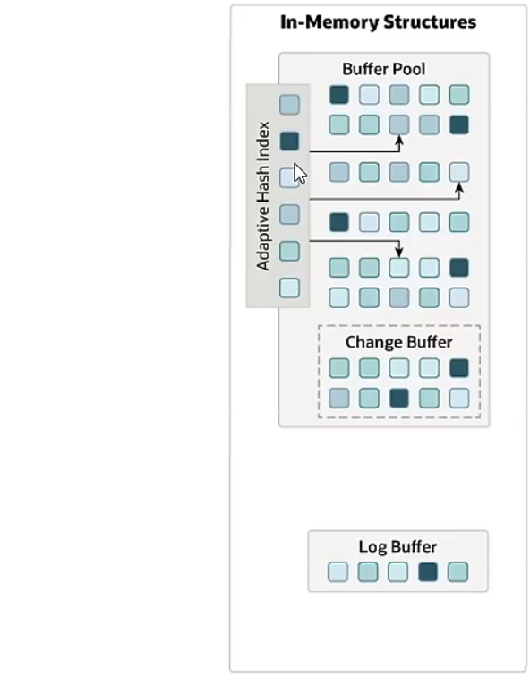

# 锁、InnoDB引擎高级

## 1. 锁

### 1.1 全局锁

**定义**

* 全局锁会锁所有库中的所有表，**被锁的表只能进行查询操作，所有写操作都会阻塞。**

**使用**

~~~sql
-- 创建全局锁
flush tables WITH READ LOCK;

-- 用途
-- 执行数据库备份操作，如果不是备份本地的数据库，就需要使用-h命令配置MySQL的主机地址
mysqldump [-h 192.168.130.128] -uroot -proot test > D:/xiongyangyang/documents/SQL转储/test.sql

-- 关闭全局锁
unlock tables;
~~~

### 1.2 表锁

**定义**

* 表锁会指定锁住哪一个表，不会影响到其他的表

**读锁**

* 使用读锁会导致当前连接和其他连接都只能进行数据的读取操作，不能进行写入操作

  ~~~sql
  -- 创建读锁
  lock tables user read;
  -- 释放读锁
  unlock tables;
  ~~~

**写锁**

* 使用写锁会导致其他连接既不能进行读操作，也不能进行写操作，但是当前连接可以进行读写操作

  ~~~sql
  -- 创建写锁
  lock tables user write;
  -- 释放写锁
  unlock tables;
  ~~~

**元数据锁（MDL）**

* meta data lock，保护表结构的锁，当一个会话对表进行增删改查时，会自动添加元数据的读锁，这个读锁指的就是不能对表结构进行修改，其他的操作可以进行，所以其他的会话可以同时进行增删改的操作，但是与此同时，**如果一个未提交事务的会话开启了元数据的读锁，另一个会话准备进行对表结构进行修改的情况，修改表结构的会话就会阻塞直到另一个会话提交事务。因为MDL的读锁和写锁是互斥的。**

  ~~~sql
  -- 查看元数据表数据sql
  SELECT
  	object_type,
  	object_schema,
  	object_name,
  	lock_type,
  	lock_duration
  FROM
  	performance_schema.metadata_locks ;
  ~~~

**意向锁**

* 用来解决某个事务想要给某一个表添加表锁的时候需要去判断这个表中每一行是否添加了行锁的性能消耗

* 意向共享锁（Intention Share，简称IS），表示某个会话执行的是select类型的SQL且后面添加了lock in share mode，如果没有添加就不会创建意向锁，意向共享锁和表锁的读锁是兼容的，和写锁是互斥的。

* 意向排他锁（Intention  eXclusive，简称IX），表示某个会话执行的是写操作的类型的SQL，它和表锁中的读锁和写锁都是互斥的。

  ~~~sql
  -- 查看意向锁表数据sql
  SELECT
  	object_schema,
  	object_name,
  	lock_type,
  	lock_mode,
  	lock_data
  FROM
  	performance_schema.data_locks ;
  ~~~

  

### 1.3 行锁

* 定义
  加锁之后只会导致某一行数据加锁，其他行的数据不会受到影响，它是粒度最小的锁，并发度最高，应用于InnoDB引擎中
  
* 分类
  * 记录锁（Record Lock）
    锁定单行记录。在RC（读已提交）、RR（可重复读）事务隔离级别中使用，主要针对update和delete的写操作。查询操作后加lock in share mode会添加共享行锁，加for update会添加排他行锁，什么都不加不会添加行锁。
  * 间隙锁（Gap Lock）
    锁定索引记录之间的间隙，从给定值到上一个索引值之间，不会锁索引值的数据。在RR事务隔离级别使用，主要针对insert操作的操作，防止产生幻读。
  * 临键锁（Next-Key Lock）
    行锁加上间隙锁组成临键锁，RR隔离级别使用。
  
* 具体情景分析

  * 唯一索引列
    当条件包含索引列时，命中条件后添加记录锁，只会锁住单条记录，并且是读锁，其他数据可以访问但是不能修改，没有命中条件时添加的是间隙锁，锁住当前条件附近的两个索引之间的间隙，此时可以对间隙之外的数据进行写操作，也能对两个间隙之间的数据进行操作（不改变当前索引值和主键的情况下）。如果修改当前索引值只能往间隙之外修改，不能将索引值修改为间隙之内。

  * 非唯一索引
    当条件命中索引值时，不仅会给命中的记录加记录锁，还会给左边添加临键锁，右边加上间隙锁。

    如果没有命中索引值，添加的也是一个间隙锁，情况和唯一索引列未命中是一致。

  * 无索引
    加锁的话直接转换成共享表锁，只能进行数据读取，不能进行写操作

* 记录锁分类
  * 共享锁
    当某个共享锁锁住了一行数据，其他的共享锁可以同时获得该行的锁，但是排他锁不能获取该行的锁
  * 排他锁
    当一个事务使用排他锁锁住一行数据，其他事务在该行既不能添加共享锁，也不能添加排他锁
  * 行锁对应的具体情形
    

## 2. InnoDB引擎高级

### 2.1 逻辑存储结构

**存储结构的顺序**

* TableSpace(表空间)
  存储的是表结构、数据和索引相关数据，可以使用ibd2sid   xxx.ibd 文件的形式查看
* Segment(段)
  分成数据段、索引段、回滚段，InnoDB通过索引组织表，数据段为叶子节点，索引段为非叶子节点
* Extent(区)
  每个区的大小固定为1M，每个页默认大小为16K，所以一个区中默认包含64个页，为了保证页的连续性，每次都会从磁盘中申请4-5个区
* Page(页)
  是InnoDB中存储引擎中管理的最小单元
* Row(行)
  保存具体的数据，另外还有三个隐藏字段，row_id、trx_id、roll_ptr，具体信息MVCC

### 2.2 架构

* 整体架构
  

* **内存结构**
  

  * 缓冲池（Buffer Pool）
    缓冲池是主内存中的一个区域，里面缓存了磁盘中**经常操作**的真数据，执行增删改查操作的的时候，首先操作缓冲池的数据（如果没有数据就先从磁盘加载），然后以一定的频率刷新到磁盘，从而减少磁盘IO的次数加快处理的速度。
    缓冲池以页为单位，底层使用链表数据结构管理page。通过状态区分为三种类型：

    * free page：空闲page，未被使用。
    * clean page：被使用page，数据没有被修改过
    * dirty page：脏页，被使用过的page，数据和磁盘中的数据不一致

  * 更改缓冲区（Change Buffer）

    * 专门针对非唯一的二级索引页
    * 执行DML语句时，如果Buffer Pool中没有这些数据页(因为不是所有的数据都在缓冲池)，也不会直接操作磁盘，而是将这些修改存储到更改缓冲区中，然后在数据读取时，将数据恢复到Buffer Pool中然后一起刷到磁盘中。

  * 自适应哈希（adaptive_hash_index）

    * 用于优化对Buffer Pool数据的查询。InnoDB存储引擎会监控表上各索引页的查询，如果观察到hash索引可以提升速度就会自动建立hash索引，这个就叫做自适应hash索引。

  * 日志缓冲区（Log Buffer）

    * 用来保存要写入到磁盘中的log日志数据（redo log、undo log），默认大小为16MB，日志缓冲区的日志会定期刷新到磁盘中。如果需要进行批量的写操作的事务，可以通过增加日志缓冲区的大小节省磁盘I/O

    * 参数设置
      innodb_log_buffer_size ：缓冲区大小设置

      innodb_flush_log_at_trx_commit：日志刷新到磁盘时机设置，有关参数如下
      

* **磁盘结构**

  
  * 系统表空间（System Tablespace）
    系统表空间也叫共享表空间，是更改缓冲区的存储区域。如果表是在系统表空间而不是每个表文件或者同样表空间中创建的，他也可能包含表和数据索引（在MySQL5.x的版本中还包含InnoDB数据字典、undolog等），能进行自动扩容操作
    参数：innodb_data_file_path
  * 独立表空间（innodb_file_per_table）
    每个表的独立表空间文件，默认是开启独立表空间的，防止发生错误之后所有的表空间都放在系统表空间中导致所有数据都丢失
  * 通用表空间
  * 临时表空间
  * 撤销表空间（undo tablespace）
    用于删除表空间
  * 双写表空间（doublewrite tablespace）
    当buffer pool中的数据要写到磁盘中之前先将数据写道双写表空间中，便于系统异常时恢复数据
  * 重做日志（redo log）
    用来实现事物的持久性。分为重做日志缓冲（redo log buffer）和重做日志文件（redo log），前者是在内存中，后者是存放在磁盘中。当事务提交之后会将所有的修改信息存储到日志中，用于刷新脏页到磁盘发生错误时进行数据的恢复。

* **后台线程**

  * 这块没听懂

    

### 2.3 事物的原理

* 事务的四大特性
  A（原子性）undo log实现
  C（一致性）undo log + redo log
  I（隔离性）MVCC＋ 锁
  D（持久性）redo log实现

* 持久性实现原理

  当一个事务提交之前将此次事务操作的数据进redolog buffer中，然后在事务提交的时候通过后台线程将数据的变更通过日志的形式（顺序磁盘IO）写进磁盘文件中进行持久化操作，等到了一定的时间buffer pool就会执行数据的持久化，如果此时持久化出错就能够重新从磁盘中读取变更的情况再次进行buffer pool的持久化操作从而保证数据的持久化。（redolog 日志会定期清理）
  

* 原子性实现原理
  undo log采用的是段的方式进行管理，即之前在逻辑存储结构提到的rollback段。当某个事务开启之后，如果该事务中出现了写操作，就会获取当前时间数据库的原始数据并且提供一个地址值作为下一个版本的回滚指针，然后该事务每次进行数据库操作时，undo log都会生成一次将修改后的数据恢复为修改前数据的操作，例如事务进行添加操作，那undo log就会进行一次删除操作将添加后的数据恢复为事务开始时的数据，如果这个事务最终出现异常需要回滚那只要执行undo log从最新到这次事务开启之间的操作就能将数据恢复到事务开始前的数据了。如果成功之后undo log日志不会立即删除，因为有可能其他的事务需要用到它进行MVCC的操作。如果当前事务进行的是插入数据的操作，那么当事务提交之后这个事务的undo log日志就可以被删除，因为他没有记录上一个版本的回滚指针（没有上一个版本），所以MVCC也就使用不到它。

### 2.4 MVCC

* 定义
  多版本并发控制（Multi-Version Concurrent Control），可以让事务读取到不同的版本的数据

* 基本概念
  **当前读**

  当读取数据时添加了锁，就会变成当前读。指的是当前的事务读取到的是最新的数据，即当前的事务还没有提交，在开始事务和提交事务之间数据有了一定的变化，但是还能读取到别的事物修改后的最新的数据。
  **快照读**
  没有加锁，读取的是快照的数据。
  **不同事务隔离级别中快照的产生**

  * RC（读已提交）
    每次select语句都会创建一个快照。即每次可以读取到已提交的事务的最新值。
  * RR（可重复读）
    在事务开启之后的第一次select语句时创建快照，之后在事务提交之前获取的都是快照的数据（非最新）
  * 串行化
    快照读会自动退化为当前读

* 实现原理
  
  * 隐藏字段
    
  
    * DB_TRX_ID
      当前行数据的最近的事务id
  
    * DB_ROLL_PTR
  
      事务回滚指针地址
  
    * DB_ROW_ID
      只有在该表没有指定主键的情况下会自动创建
    
  * undo log日志
    在每个写事务操作数据之前，undo log日志会记录上一个版本的数据然后将该记录的地址返回给修改后这个事务修改后数据的ROLL_PTR，进而让下一个版本能够通过它找到前一个版本的数据方便进行回滚操作。当多次修改之后就会出现一条undo log版本链。每一个版本的数据中都通过DB_ROLL_PTR指向前一个版本的数据，这个链的头部是最新的数据，尾部是最旧的数据，并且记录了生成这条数据的事务ID。
  
  * readview 读视图
    readview是用来记录当前活跃的事务（未提交）和给每个版本分配事务id的。在每个事务进行写操作的时候readview都会给每个新版本分配一个自增的DB_TRX_ID用来记录操作该数据的事务id，然后通过定义的版本选择规则去undo log日志中从最新的数据以此向后选出符合规则中最新的数据用于查询操作的返回结果。如果进行的是读操作，那么就会给该事务分配0作为DB_TRX_ID用于区别读操作和写操作。具体筛选规则如下图，匹配逻辑应该是  **if（ !3 && (1 || 2 || 4)）**返回数据
  
    ~~~java
    ReadView readView = new ReadView();
    // 从链表的头部开始遍历
    for (RowData data = new RowData(); data.DB_ROLL_PTR != null;
         data = data.DB_ROLL_PTR) {
                if (data.trx_id == readView.creator_trx_id ||
                        (data.trx_id >= readView.min_trx_id && data.trx_id <=                              readView.max_trx_id &&
                         !readView.m_ids.contains(data.trx_id)) ||
                        data.trx_id < readView.min_trx_id
                   ) {
                    return data;
                }
            }
    return null;
    ~~~
  
    
  
    **read view 中主要字段**
  
    
  
    **read view 版本链筛选规则**
  
    

### 2.5 MySQL管理

**MySQL数据库中各个系统数据库的存储内容**

**MySQL工具**

