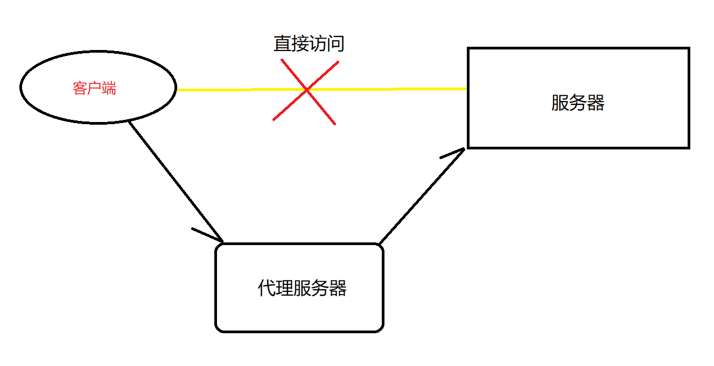
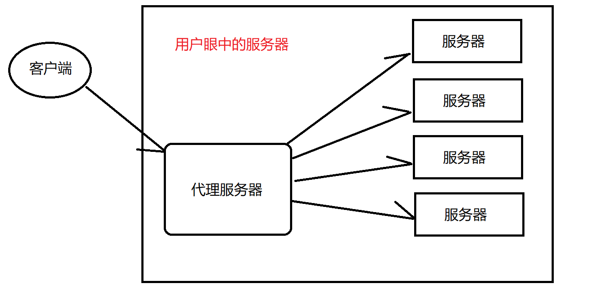

# Nginx

## 1、概念

### 1.1 正向代理

当客户端需要访问某个地址时，没有直接进行访问，而是通过先访问配置好的代理服务器，然后让代理服务器去真正的访问目标地址，然后将得到的数据返回给用户，它是给客户端使用的

例如家中安装的宽带，当我们连接WIFI访问网络时，我们发送请求给宽带，然后宽带就会去访问目标网址，然后将访问的结果返回给用户。

### 1.2 反向代理

客户端访问某个地址的时候，服务器不想直接暴露自己的地址、或者接收请求的地址有多个，从而不能直接让客户端方位自己的地址，就需要使用代理服务器将自己的原始服务器地址进行加密，所以当客户端想要访问真实的地址功能时去访问暴露在外的代理服务器地址，然后代理服务器将请求转发给真实的服务器地址进行访问。

利用反向代理可以进行真实地址的加密和负载均衡

### 1.3 动静结合

将服务器种的静态资源和动态资源分开放置，动态资源就是我们的服务器，静态资源放置到另一台服务器，然后可以实现动静分离的效果

## 2. Linux服务器安装Nginx及其基本操作

### 2.1 安装Nginx的依赖库

主要包括：**GCC，PCRE，zlib，OpenSSL，**执行下面的命令一次性安装即可

~~~shell
yum install -y gcc pcre pcre-devel zlib zlib-devel openssl openssl-devel
~~~

通过网络下载nginx

~~~shell
wget http://nginx.org/download/nginx-1.18.0.tar.gz
~~~

解压

~~~shell
tar -zxvf ngix压缩包
~~~

编译以及安装

~~~shell
make && make install
~~~

启动nginx

~~~shell
-- 默认的nginx在/usr/local/nginx目录下
-- 进入它的sbin目录下可以执行相关操作
-- 启动nginx
./nginx
-- 关闭nginx
./nginx -s stop
-- 热部署（重新加载）
./nginx -s reload
-- 查看当前nginx的状态
ps -ef | grep nginx
~~~

